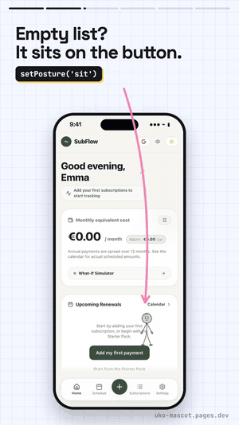
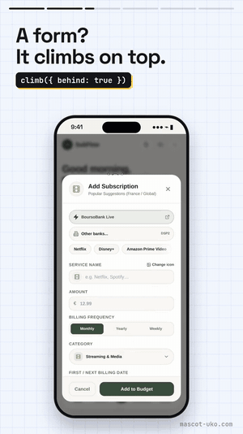
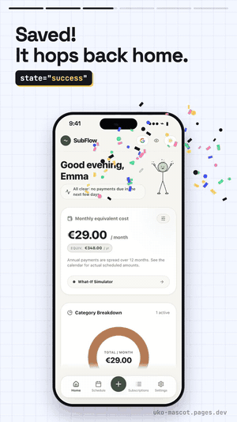
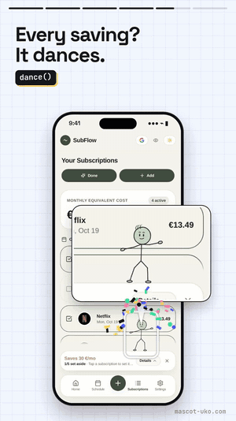
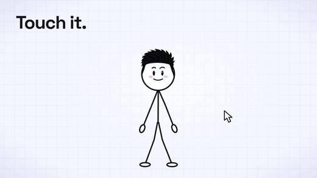

<p align="center">
  
</p>

<h1 align="center">Uko — a living mascot for your app</h1>

<p align="center">
  A stick-figure mascot that acts out every state of your interface: <b>welcome, loading, success, error, empty, sleep…</b><br>
  It breathes, blinks, reacts to touch and never freezes. One tag on the web, one Rive file everywhere else.<br>
  With the full pack, it sits on your cards, climbs your modals, hops and dances, wherever you decide.
</p>

<p align="center">
  <a href="https://uko-mascot.pages.dev/en/"><b>Website</b></a> ·
  <a href="https://uko-mascot.pages.dev/en/#galerie"><b>Try the colors and hairstyles</b></a> ·
  <a href="https://uko-mascot.pages.dev/free/Uko-Starter.zip"><b>Download (free)</b></a> ·
  <a href="https://www.youtube.com/@Hosh-uko"><b>YouTube</b></a>
</p>

<p align="center">
  
  
  
  
  
</p>

<p align="center"><i>Français : <a href="README.fr.md">README.fr.md</a> · Español: <a href="README.es.md">README.es.md</a></i></p>

---

This repository is **Uko Starter**, the free edition: the files you get in the download, ready to use.
Version 2.6.1.

| | Free (this repository) | Full pack ★ |
|---|---|---|
| Characters | Uko, Aituko the robot, Meowuko the cat | same |
| States (web engine) | all 9: `idle` `welcome` `thinking` `loading` `success` `error` `empty` `sleep` `wake` | same |
| Hairstyles (Uko) | 3: `original`, `classique`, `chauve` | 17 |
| Colors, light and dark themes, touch reactions | ✓ | ✓ |
| Rive files (iOS, Android, Flutter, React Native) | all 3 characters, 4 states each | all 3 characters, 9 states each |
| Postures: sits on a card, leans on a window, lies along an edge, dances, floats | — | ✓ |
| Moves: hops, climbs, walks, turns around | — | ✓ |
| One line to place it on any element: `uko.placeOn(card, { posture: 'sit' })` | — | ✓ |
| A soul: reacts to where it is touched, to the moment and to its mood | — | ✓ |
| Speech: its mouth follows a voice, recorded or synthesized | — | ✓ |
| Eyes that follow the whole page | — | ✓ |
| Commercial use | ✓ | ✓ |
| Price | free | €5.99 launch price, then €9.99 · paid once |

The full pack is not on sale yet: [get a single email when it is out](https://uko-mascot.pages.dev/en/#prix).
Moving to it means replacing the files: your code does not change.

### The full pack, filmed in a real app

It has a soul: it reacts to where it is touched, to the moment and to its mood. Each move is one line, wherever you decide. In [SubFlow](https://uko-mascot.pages.dev/en/#ia), a subscription tracker, it sits on the empty list's button, climbs onto the form, hops back home and dances on every saving:

<p align="center">
  
  
  
  
</p>

<p align="center"></p>

```js
uko.placeOn('#empty-list button', { posture: 'sit' });     // sits on the button
uko.placeOn(modal, { posture: 'lean', move: 'climb' });    // climbs up and leans on the modal
await uko.goHome();                                        // back to its place
uko.dance();                                               // a free dance, never twice the same
```

### Free: every state, touch reactions included

<p align="center"></p>

## Quick start

**HTML**

```html
<script src="uko-mascot-engine.min.js"></script>

<uko-mascot state="loading" hair="classique" brand="#FFE3C4" style="width:160px;height:240px"></uko-mascot>
<uko-mascot character="meowuko" state="welcome" brand="#FFD9B3" style="width:160px;height:240px"></uko-mascot>   <!-- or "aituko" -->
```

```js
document.querySelector('uko-mascot').setAttribute('state', 'success');
```

**React**

```jsx
import './uko-mascot-engine.min.js';

export function Status({ busy, done }) {
  const state = busy ? 'loading' : done ? 'success' : 'idle';
  return <uko-mascot state={state} hair="chauve" style={{ width: 160, height: 240 }} />;
}
```

**JavaScript**

```js
const uko = UkoMascot.create('#mascot', { hairStyle: 'classique', brandColor: '#DDE3FF' });
uko.startLoading();      // during a request
uko.resolveSuccess();    // … then the celebration
```

**Rive** (web, iOS, Android, Flutter)

```js
import { Rive } from '@rive-app/canvas-lite';

const input = name => uko.stateMachineInputs('Uko').find(i => i.name === name);
const uko = new Rive({
  src: 'rive/uko.riv', canvas: document.querySelector('canvas'), stateMachines: 'Uko', autoplay: true,
  onLoad: () => { uko.resizeDrawingSurfaceToCanvas(); input('state').value = 2; },   // 0 idle, 2 loading
});
// later, when the request has succeeded (triggers: welcome, success; the free Rive files have 4 states)
function done() { input('state').value = 0; input('success').fire(); }
```

Complete examples for React, Flutter, iOS (Swift) and Android (Kotlin) are in [`examples/`](examples).
To fit the mascot to your app with Claude, ChatGPT, Cursor or Copilot, use [`AI-PROMPT.md`](AI-PROMPT.md).
Full documentation: [README.en.md](README.en.md).

## Files

| File | What |
|---|---|
| `uko-mascot-engine.min.js` | The web engine to load in your site or app (55 KB gzip, zero dependencies) |
| `uko-mascot-engine.js` | The same code, readable |
| `rive/uko.riv`, `rive/aituko.riv`, `rive/meowuko.riv` | The same mascots for iOS, Android, Flutter, React Native and the web (74 KB each) |
| `examples/` | One ready-to-open example per platform |
| `AI-PROMPT.md` | The prompt to fit the mascot to your app with AI |
| `CHANGELOG.md` | What changed in each version |

## License

Free, commercial use included: use Uko in as many personal or commercial projects as you like and modify it,
including with AI. Do not redistribute or resell the files on their own, or present the characters as your own
creation or brand. See [LICENSE.md](LICENSE.md) (French; it prevails over any translation).
Questions and bug reports: [issues](https://github.com/hoshuko/uko-mascot/issues).
