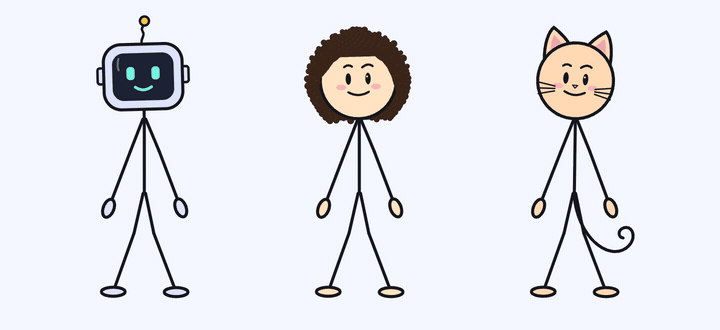
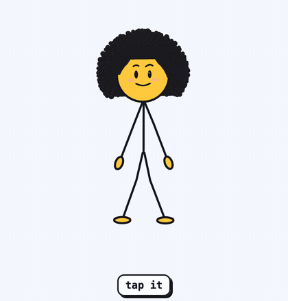

<p align="center">
  
</p>

<h1 align="center">Uko — a living mascot for your app</h1>

<p align="center">
  A stick-figure mascot that acts out every state of your interface: <b>welcome, loading, success, error, empty, sleep…</b><br>
  It breathes, blinks, reacts to touch and never freezes. One tag on the web, one Rive file everywhere else.
</p>

<p align="center">
  <a href="https://uko-mascot.pages.dev/en/"><b>Website</b></a> ·
  <a href="https://uko-mascot.pages.dev/en/#galerie"><b>Try the colours and hairstyles</b></a> ·
  <a href="https://uko-mascot.pages.dev/free/Uko-Starter.zip"><b>Download (free)</b></a> ·
  <a href="https://www.youtube.com/@Hosh-uko"><b>YouTube</b></a>
</p>

<p align="center">
  
  
  
  
</p>

<p align="center"><i>Français : <a href="README.fr.md">README.fr.md</a> · Español: <a href="README.es.md">README.es.md</a></i></p>

---

This repository is **Uko Starter**, the free edition: the files you get in the download, ready to use.

| | Free (this repository) | Full pack ★ |
|---|---|---|
| Characters | Uko, Aituko the robot, Meowuko the cat | same |
| Hairstyles (Uko) | 3: `original`, `classique`, `chauve` | 17 |
| States (web engine) | all 9: `idle` `welcome` `thinking` `loading` `success` `error` `empty` `sleep` `wake` | same |
| Rive files (mobile) | all 3 characters, 4 states each | all 3 characters, 9 states each |
| Colours, light and dark themes, touch reactions | ✓ | ✓ |
| Movements: sits on a card, leans on a window, dances, floats, hops, climbs, walks, turns around | — | ✓ |
| Gaze over the whole page | — | ✓ |
| Commercial use | ✓ | ✓ |

The full pack is not on sale yet: [tell us if you are interested](https://uko-mascot.pages.dev/en/#prix).
Moving to it means replacing the files: your code does not change.

<p align="center"></p>

## Quick start

**HTML**

```html
<script src="uko-mascot-engine.min.js"></script>

<uko-mascot state="loading" hair="classique" brand="#FFE3C4"></uko-mascot>
<uko-mascot character="meowuko" state="welcome" brand="#FFD9B3"></uko-mascot>   <!-- or "aituko" -->
```

```js
document.querySelector('uko-mascot').setAttribute('state', 'success');
```

**React**

```jsx
import './uko-mascot-engine.min.js';

export function Status({ busy, done }) {
  const state = busy ? 'loading' : done ? 'success' : 'idle';
  return <uko-mascot state={state} hair="chauve" style={{ width: 160, height: 240 }} />;
}
```

**JavaScript**

```js
const uko = UkoMascot.create('#mascot', { hairStyle: 'classique', brandColor: '#DDE3FF' });
uko.startLoading();      // during a request
uko.resolveSuccess();    // … then the celebration
```

**Rive** (web, iOS, Android, Flutter)

```js
import { Rive } from '@rive-app/canvas-lite';

const uko = new Rive({ src: 'rive/uko.riv', canvas: document.querySelector('canvas'), stateMachines: 'Uko', autoplay: true });
const input = name => uko.stateMachineInputs('Uko').find(i => i.name === name);
input('state').value = 2;   // 0 idle, 2 loading
input('success').fire();    // triggers: welcome, success (the free Rive files have 4 states)
```

Complete examples for React, Flutter, iOS (Swift) and Android (Kotlin) are in [`examples/`](examples).
To fit the mascot to your app with Claude, ChatGPT, Cursor or Copilot, use [`AI-PROMPT.md`](AI-PROMPT.md).
Full documentation: [README.en.md](README.en.md).

## Files

| File | What |
|---|---|
| `uko-mascot-engine.min.js` | The web engine to load in your site or app (53 KB gzip, zero dependencies) |
| `uko-mascot-engine.js` | The same code, readable |
| `rive/uko.riv`, `rive/aituko.riv`, `rive/meowuko.riv` | The same mascots for iOS, Android, Flutter, React Native and the web (74 KB each) |
| `examples/` | One ready-to-open example per platform |
| `AI-PROMPT.md` | The prompt to fit the mascot to your app with AI |
| `CHANGELOG.md` | What changed in each version |

## License

Free, commercial use included: use Uko in as many personal or commercial projects as you like and modify it,
including with AI. Do not redistribute or resell the files on their own, or present the characters as your own
creation or brand. See [LICENSE.md](LICENSE.md) (French; it prevails over any translation).
Questions and bug reports: [issues](https://github.com/hoshuko/uko-mascot/issues).
